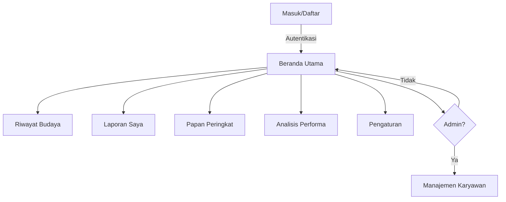

# Dokumen Teknis: Stitch 360 (CendolBata)

Dokumen ini berisi analisis teknis mendalam, struktur data, dan alur kerja aplikasi platform manajemen budaya Stitch 360 dalam Bahasa Indonesia.

## 1. Ikhtisar Arsitektur
Aplikasi ini menggunakan **Modular Front-end Architecture** dengan Bootstrap 5.3 untuk responsivitas *mobile-first*.
- **Navigasi Modular:** Menggunakan `js/components.js` untuk injeksi konten statis (Navbar/Sidebar) guna memastikan konsistensi dan kemudahan *maintenance*.
- **Sistem Offline:** Semua aset dimuat secara lokal (CDN) agar dapat dijalankan langsung via protokol `file://` atau server ringan.

## 2. Alur Aplikasi (Flowchart)


## 3. Desain Basis Data (ERD)
Representasi relasi entitas:

```mermaid
erDiagram
    KARYAWAN ||--o{ TRANSAKSI_CENDOL : "mengirim/menerima"
    KARYAWAN ||--o{ LAPORAN_INSIDEN : "membuat"
    DEPARTEMEN ||--o{ KARYAWAN : "berisi"
    KARYAWAN ||--|| PERAN : "memiliki"
    
    KARYAWAN {
        int id
        string nama
        string email
        string kata_sandi
        int id_departemen
        int id_peran
    }
    
    TRANSAKSI_CENDOL {
        int id
        int id_pengirim
        int id_penerima
        string kategori
        string pesan
        datetime waktu_transaksi
    }
    
    LAPORAN_INSIDEN {
        int id
        int id_pelapor
        string tipe
        string deskripsi
        string status
        bool adalah_anonim
    }
```



## 4. Spesifikasi Autentikasi & Keamanan
- **Alur Login:** Aplikasi melakukan validasi kredensial (simulasi) di sisi klien. Dalam produksi, ini harus diarahkan ke endpoint API (`POST /api/auth/login`).
- **Manajemen Sesi:** Setelah login berhasil, ID pengguna dan token harus disimpan di `localStorage` atau `sessionStorage`.
- **Keamanan Sandi:** Implementasi fitur *Toggle Sandi* menggunakan manipulasi tipe input DOM (`password` vs `text`).

## 5. Spesifikasi API (Simulasi Data)
Untuk pengembangan fungsionalitas di masa depan, gunakan format JSON berikut:

### Karyawan (GET /api/karyawan)
```json
{
  "id": 1,
  "nama": "Budi Santoso",
  "email": "budi@perusahaan.com",
  "departemen": "IT",
  "jabatan": "Senior Developer"
}
```

## 6. Alur Kerja Fitur Pencarian
1. **Input:** Pengguna mengetik minimal 2 karakter pada kotak pencarian Navbar.
2. **Filter:** Data karyawan difilter secara *real-time* berdasarkan properti `nama` atau `departemen`.
3. **Tampilan:** Hasil disajikan dalam *dropdown* yang menyertakan avatar dan jabatan.
4. **Interaksi:** Klik pada hasil akan mengarahkan pengguna ke halaman yang relevan atau membuka *modal aksi*.

## 7. Penanganan Error & Notifikasi
- **Feedback Positif:** Menggunakan `Bootstrap Toast` untuk notifikasi sukses (misal: "Cendol berhasil dikirim").
- **Error Umum:** Validasi *frontend* (HTML5 `required`) digunakan untuk mencegah pengiriman data kosong.
- **Pesan Sistem:** Jika pemuatan komponen dinamis gagal, sistem akan menampilkan peringatan di area placeholder.

## 8. Panduan Deployment
1. **Prasyarat:** Browser modern (Chrome/Edge/Firefox).
2. **Struktur Folder:** Pastikan `mockup/` berisi semua file aplikasi.
3. **Menjalankan Aplikasi:**
   - Cukup buka `index.html` di browser.
   - Jika membutuhkan fitur *Live Reload*, gunakan `npx serve mockup/`.
4. **Menambahkan Halaman:**
   - Gunakan `index.html` sebagai *template*.
   - Pasang placeholder navigasi (`#navbar-placeholder`, `#sidebar-placeholder`).
   - Panggil `js/components.js`.
